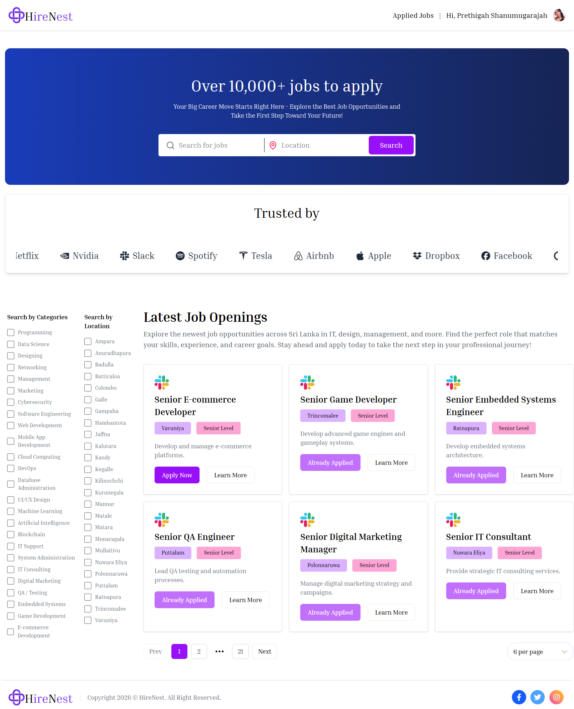
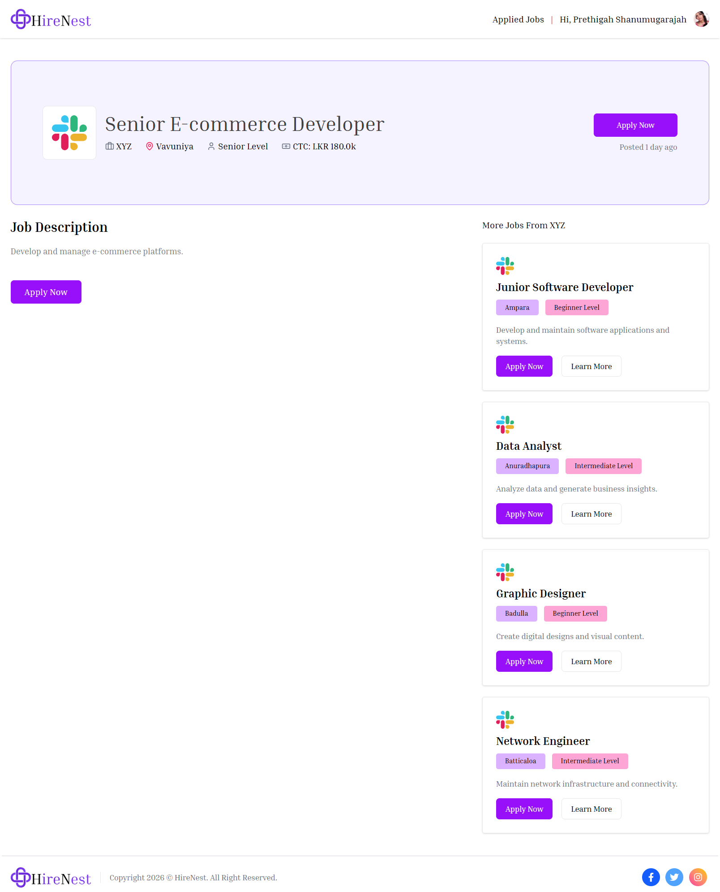
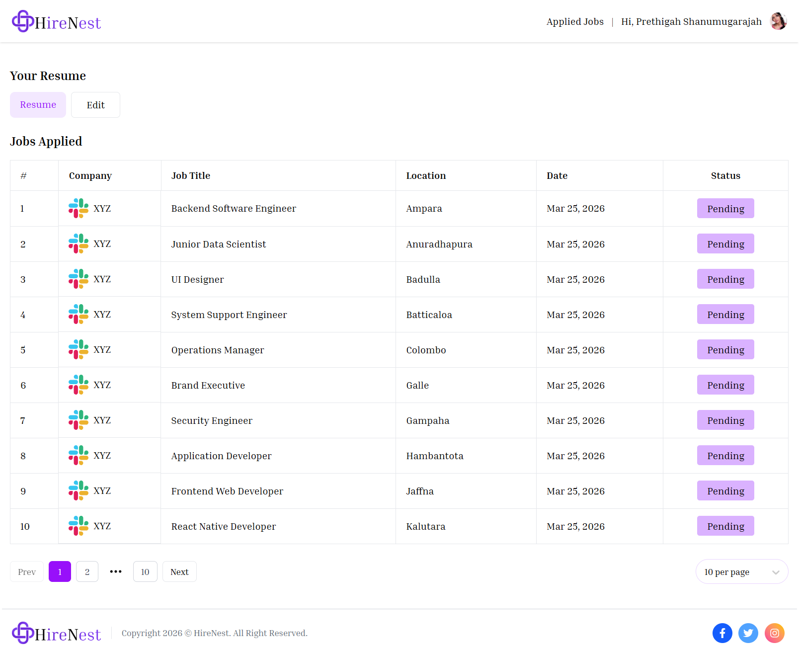
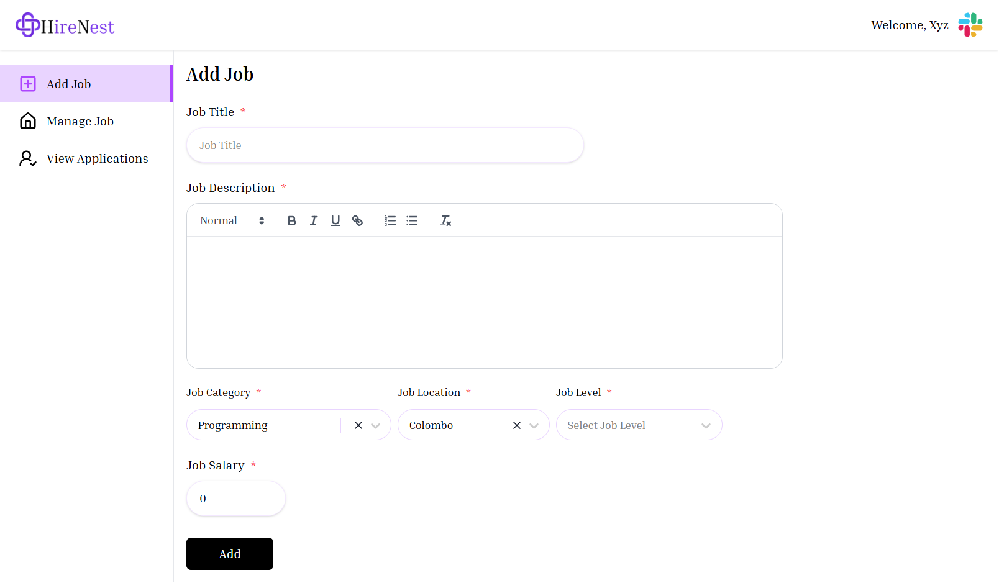
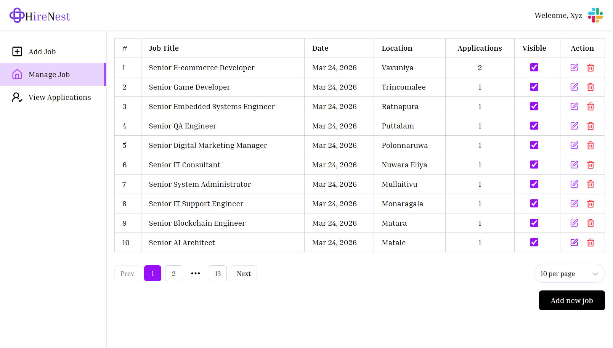
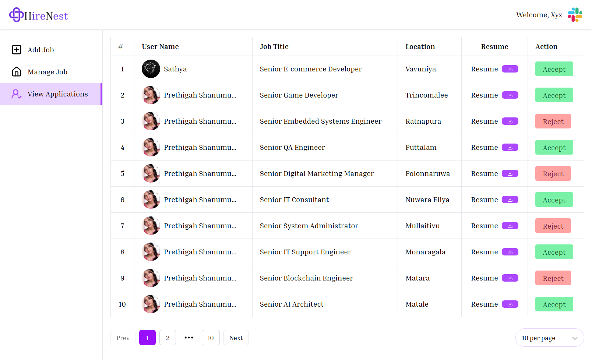

# 💼 HireNest

[](https://react.dev/)
[](https://nodejs.org/)
[](https://www.mongodb.com/)
[](https://expressjs.com/)
[](https://tailwindcss.com/)

---

# 💼 About HireNest

**HireNest** is a full-stack **Job Portal Web Application** built using the **MERN Stack (MongoDB, Express.js, React.js, Node.js).**

It connects **job seekers and recruiters** in a modern recruitment platform where users can search and apply for jobs while recruiters can post jobs and manage applications.

The application allows users to:

- Search and apply for jobs
- Upload resumes and manage profiles
- Recruiters to post and manage jobs
- Review job applications and candidates
- Manage job visibility and applications
- Track applications and hiring process

HireNest includes **secure authentication using Clerk**, **error monitoring with Sentry**, and **deployment on Vercel**, making it a **real-world full-stack recruitment platform**.

This project simulates a **modern job portal system**, focusing on:

- Role-based system (Job Seeker / Recruiter)
- Job posting and application management
- Resume upload and profile management
- Secure authentication
- Error tracking and monitoring
- Modern responsive UI
- Deployment-ready architecture

A **portfolio-ready full-stack job portal application.**

---

# ✨ Features

## 👤 Job Seeker Features

- User authentication
- View available jobs
- Search and filter jobs
- Apply for jobs
- Upload and update resume
- View applied jobs
- Manage user profile
- Pagination for job listings
- Responsive UI

## 🏢 Recruiter Features

- Recruiter authentication
- Post new jobs
- Update job details
- Delete jobs
- Show / Hide job visibility
- View job applications
- Review candidate resumes
- Manage company profile
- Pagination for applications and jobs

---

# 🛠️ Technologies Used

## Frontend

- React (Vite)
- Tailwind CSS
- React Router DOM
- Axios
- React Toastify
- React Spinners
- Lucide React Icons
- Clerk Authentication

---

## Backend

- Node.js
- Express.js
- MongoDB
- Mongoose
- REST APIs
- Clerk Webhooks
- Sentry Error Tracking
- Multer (File Uploads)
- Cloudinary (File Storage)
- JWT / Clerk Authentication

---

# 📸 Screenshots

## 🏠 Home Page



---

## 📝 Apply Job Page



---

## 📄 Applications Page



---

## ➕ Add Job Page



---

## 🗂️ Manage Jobs Page



---

## 👥 View Applications Page



---

# ⚙️ How to Run the Project

## 1️⃣ Clone Repository

```bash
git clone https://github.com/PrethigahShanmugarajah/HireNest.git
cd HireNest
```

---

## 2️⃣ Backend Setup (Server)

```bash
cd Server
npm install
npm run server
```

---

## 3️⃣ Frontend Setup (Client)

```bash
cd Client
npm install
npm run dev
```

---

# 🔑 Environment Variables

## 📂 Server (.env)

```
PORT=
MONGODB_URI=
SENTRY_DSN=
CLERK_PUBLISHABLE_KEY=
CLERK_SECRET_KEY=
CLERK_WEBHOOK_SECRET=
CLOUDINARY_NAME=
CLOUDINARY_API_KEY=
CLOUDINARY_API_SECRET=
JWT_SECRET=
JWT_SECRET_EXPIRES=
```

---

## 📂 Client (.env)

```
VITE_CLERK_PUBLISHABLE_KEY=
VITE_CURRENCY=
VITE_BASEURL=
```

---

# 👨‍💻 Author

**Prethigah Shanmugarajah (2020/2021)** <br>
Department of Software Engineering <br>
Faculty of Computing <br>
Sabaragamuwa University of Sri Lanka

---
